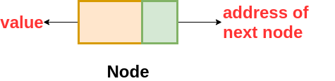

# Linked Lists 

**What is Linked List**

*A linked list is a linear data structure, in which the elements are not stored at contiguous memory locations. The elements in a linked list are linked using pointers as shown in the below image:*

---

**Growing a linked list**

*like with an array, we can add elements and remove elements from a linked list. But unlike arrays, we don’t need to allocate memory in advance or copy and re-create our linked list, since we won’t “run out of space” the way we might with a pre-allocated array.*

---

**Properties of Linked List**

- It can be visualized as a chain of nodes where each node contains the location of the next node .

- The structure of the node is 

- The first node of the linked list is called the `head of the linked list`

- The last node of the linked list is pointing to NULL(None) which indicates that it is the last node.

- Unlike arrays, linked list elements are not stored at contiguous memory locations.

- Linked Lists addresses some of the limitations of arrays of having a fixed size because Linked Lists are dynamic in nature.

---

**Types of Linked List:**

- Singly Linked List : 

*It is the most common. Each node has data and a pointer to the next node.*

- Doubly Linked List :

*We add a pointer to the previous node in a doubly-linked list. Thus, we can go in either direction: forward or backward.*

- Circular Linked List : 

*A circular linked list is a variation of a linked list in which the last element is linked to the first element.*

---

**Parts of a linked list**

*A linked list can be small or huge, but no matter the size, the parts that make it up are actually fairly simple. A linked list is made up of a series of nodes, which are the elements of the list.*

---

# THE END

