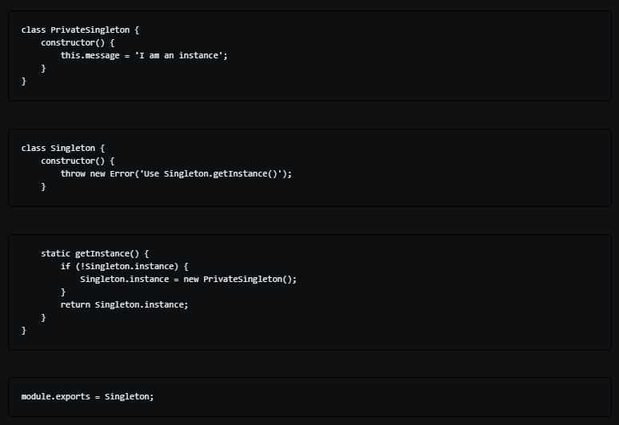

# Authentication

---

 ## what a “Singleton” ?

 *is a class that allows only a single instance of itself to be created and gives access to that created instance. It contains static variables that can accommodate unique and private instances of itself. It is used in scenarios when a user wants to restrict instantiation of a class to only one object*

---

 ## How the Singleton pattern can be used with Node modules, specifically with classes ?

 *It is a good starting point. In its core, it restricts a class to have just one instance and ensures that it is globally accessible. It might come in handy when you need to manage something from across your whole application.*

---
## If you were tasked with building a middleware system like Express uses, what approach might you take to construct/operate it?

- create layers in middleware  ( request , response and next )

- Allow the middleware to have access to both layers.

- Allow the middleware to end the process or move to the next middleware .

---

##  Vocabulary Terms

Word | Definition 
------------ | -------------
Router Middleware | the way in which the client requests are handled by the application endpoints. And when you make some routers in separate file, that can use them by using middleware.
Dynamic Module Loading | The advantage of dynamic load modules is that when you find a problem in your module, you can correct the problem and get a new version of your code running without major disruptions.
Singleton Pattern|is a software design pattern that restricts the instantiation of a class to one "single" instance. This is useful when exactly one object is needed to coordinate actions across the system.
Application Middleware | Middleware that plays a role in the function of the application.
CRUD -> REST Method Matches|t is an acronym for C - create, R - read/retrieve, U -update, D - delete- the four basic functions that are implemented in any relational DB applications.
Mock Testing | is an approach to unit testing that lets you make assertions about how the code under test is interacting with other system modules. In mock testing, the dependencies are replaced with objects that simulate the behavior of the real ones.

---

## Securing Passwords

**Bcrypt hash password**

*`bcrypt` was designed for password hashing hence it is a slow algorithm. This is good for password hashing as it reduces the number of passwords by second an attacker could hash when crafting a dictionary attack.*

**PROBLEMS WITH CRYPTOGRAPHIC HASH ALGORITHM**

- Brute Force attack 
- Hash Collision attack

    **BCrypt, IT's SLOW AND STRONG AS HELL**

*This method of hashing passwords is solid enough for most web applications that stores users' passwords and other sensitive data*

---

## Basic Auth

*is a method for an HTTP user agent (e.g. a web browser) to provide a user name and password when making a request. In basic HTTP authentication, a request contains a header field in the form of Authorization: Basic < credentials>, where credentials is the Base64 encoding of ID and password joined by a single `colon :`

**Features**

*HTTP Basic authentication (BA) implementation is the simplest technique for enforcing access controls to web resources because it does not require cookies, session identifiers, or login pages.*

---

## Authentication

*is the process of verifying that an individual, entity or website is whom it claims to be.*

---

## bcrypt.js

*is js library to help you hash the passwords.*

---

# THE END