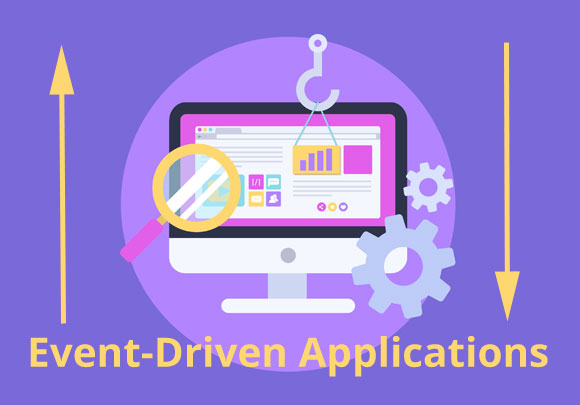

# Event Driven Applications 

---

## 1- Why is access control important?

*its important because it is a valuable security technique that can be used to regulate who or what can view or use any given resource.Without proper access control you could leave your staff and your company wide open to problems such as data loss, theft or breach of privacy and data protection laws*

---

# 2- Describe an application that would need access control.

*`business-to-business software-as-a-service` to non-profit organizations. Your product allows non-profits to create, manage, and market products to potential donors.*

*You want to use Auth0 to control the access of your non-profit customers to different parts of your application. Without RBAC, all non-profit employees and volunteers will have access to all features of your application*

---

# 3- What is a role used for? 

*it used to restriction the capabilities of some users so some can (read,write,update and delete) and som can only do some of these capabilities*

---

# 4- Why is role based access control more scalable than discretionary or mandatory access control?

**Mandatory Access Control**

*is the strictest of all levels of control. The design of MAC was defined, and is primarily used by the government*

**Discretionary Access Control**

*allows each user to control access to their own data. DAC is typically the default access control mechanism for most desktop operating systems.*

**Role Based Access Control**

*is based on a user's job function within the organization to which the computer system belongs*

---

##  Vocabulary Terms

Word | Definition 
------------ | -------------
Authorization | is the process of determining if the user has permission to perform a given operation
RBAC | is based on a user's job function within the organization to which the computer system belongs
Capabilities | the functions that determine if a user can do read , write , update or delete .

---

## Event Driven Programming

 *a program is designed to respond to user engagement in various forms. It is known as a programming paradigm in which the flow of program execution is determined by “events.” Events are any user interaction, such as a click or key press, in response to prompt from the system.*

*For the most recognizable example of Event-Driven Programming for people at any level of programming skill, we’ll turn to our old friend The Web Browser.*

*Every time you interact with a webpage through it’s user interface, an event is happening. When you click a button a click event is triggered. When you press a key a keydown event is triggered. These events have associated functions that, when triggered, are executed to make a change to the user interface in some way.*

 ---

 ## Node docs: events 

 **Examples**

 - Class: EventEmitter
    - Event: 'newListener'
    - Event: 'removeListener'

---

# THE END