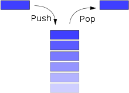

# Stacks and Queues

*A `stack` (sometimes called a “push-down stack”) is an ordered collection of items where the addition of new items and the removal of existing items always takes place at the same end. This end is commonly referred to as the “top.” The end opposite the top is known as the “base.”*

*The base of the stack is significant since items stored in the stack that are closer to the base represent those that have been in the stack the longest. The most recently added item is the one that is in position to be removed first. This ordering principle is sometimes called LIFO, last-in first-out. It provides an ordering based on length of time in the collection. Newer items are near the top, while older items are near the bas*

---

## Stack Visualization

- Push O(1)
- Pop O(1)
- isEmpty O(1)
- Peek O(1)

---

# What is a Queue 

*is a collection of entities that are maintained in a sequence and can be modified by the addition of entities at one end of the sequence and the removal of entities from the other end of the sequence*

---

## Queue Visualization

- Enqueue  O(1)
- Dequeue  O(1)
- isEmpty O(1)
- Peek O(1)

---

# THE END