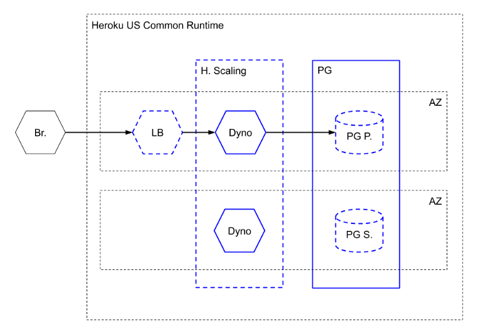
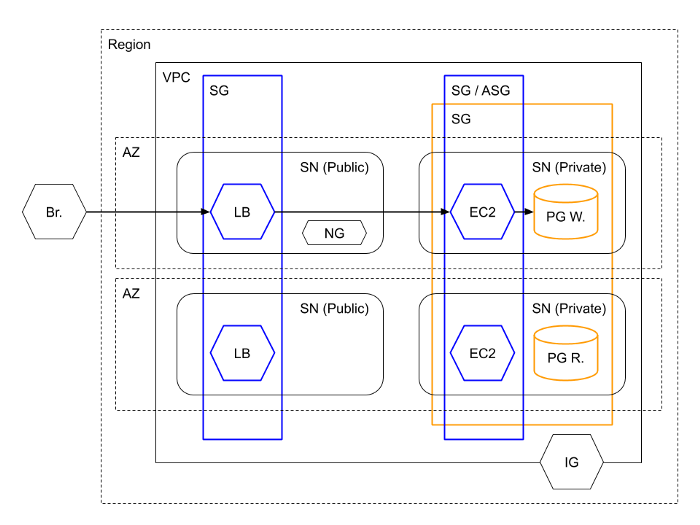
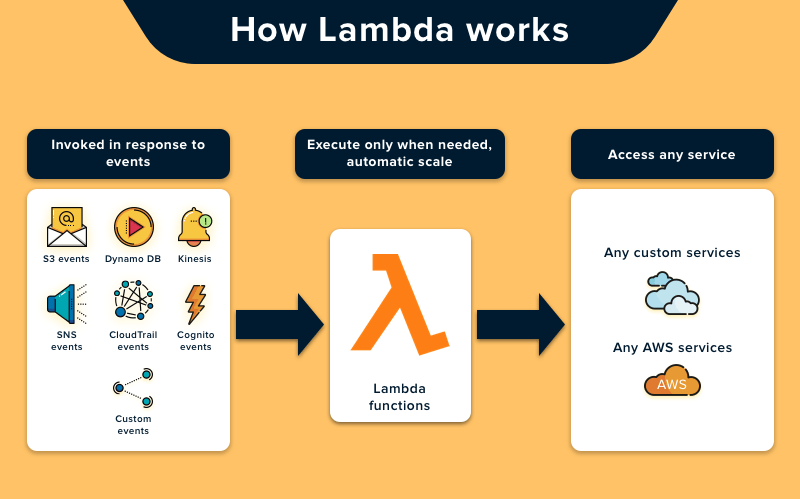

#  AWS: S3 and Lambda

---

## 1 - What’s the difference between a FIFO and a standard queue?

**`FIFO queues` have essentially the same features as `standard queues`, but provide the added benefits of supporting ordering and exactly-once processing. `FIFO queues` provide additional features that help prevent unintentional duplicates from being sent by message producers or from being received by message consumers**

---

## 2 - How can the server be assured a message was properly received?

**Retrieves the Response from the server. Helps validate the Response received from the server. Internally this class uses HTTP builder library**

---

## 3 - What classic design pattern is best represented by event driven programming?

**Most modern programming-languages comprise built-in “event” constructs implementing the observer-pattern components.**

---

## 4 - How do you test an event driven system?

**With unit tests which test individual components of the system, as well as tests for verifying the server and clients are communicating back and forth**

---

## Important Terms

Word | Definition 
------------ | -------------
Server Instances|  is a collection of SQL Server databases which are run by a solitary SQL Server service or instance
Containers | services are deeply integrated with AWS by design. This allows your container applications to leverage the breadth and depth of the AWS cloud
Cloud Services |  are services available via a remote cloud computing server rather than an on-site server.
Cloud Architecture |refers to the various components in terms of databases, software capabilities, applications, etc. engineered to leverage the power of cloud resources to solve business problems.
AWS| Amazon Web Services, a subsidiary of Amazon providing on-demand cloud computing platforms and APIs to individuals.

**Heroku Application** 

- Heroku automatically manages, e.g, performs upgrades for, the Dynos and Heroku Postgres resources

- Heroku automatically manages the DATABASE_URL and PORT environment variables

- Professional level Dynos are required to enable horizontal scaling and thus high availability (or something approximating it)

- the PostgreSQL instances are publicly available; secured using SSL and an username / password pair

**communication flow**

---

**AWS Elastic Beanstalk Application**

- AWS automatically manages, e.g, performs upgrades for, the PostgreSQL and EC2 Instances

- AWS Elastic Beanstalk automatically manages the PORT environment variable

- EC2 and PostgreSQL Instances are in private Subnets and further secured using Security Groups. 
The PostgreSQL Instances are also secured using SSL and a username / password pair

**communication flow**

---

## AWS Lambda Basics

**AWS Lambda is a service which computes the code without any server. It is said to be serverless compute. The code is executed based on the response of events in AWS services such as adding/removing files in S3 bucket, updating Amazon DynamoDB tables, HTTP request from Amazon API Gateway etc**

---

---

## CDN

**A Content Delivery Network (CDN) is a geographically distributed group of servers that work together to provide fast delivery of Internet content. A CDN allows for the fast transfer of data needed for loading Internet content including HTML pages, javascript files, stylesheets, images, and videos.**

--- 

# THE END