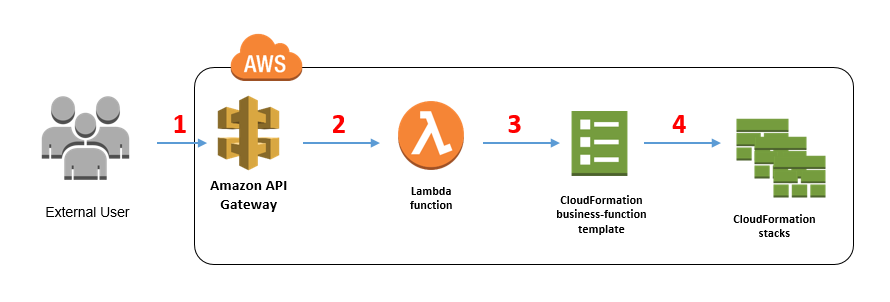

# AWS: API, Dynamo and Lambda

---

## 1 - What’s the difference between a FIFO and a standard queue?

**`FIFO queues` have essentially the same features as `standard queues`, but provide the added benefits of supporting ordering and exactly-once processing. `FIFO queues` provide additional features that help prevent unintentional duplicates from being sent by message producers or from being received by message consumers**

---

## 2 - How can the server be assured a message was properly received?

**Retrieves the Response from the server. Helps validate the Response received from the server. Internally this class uses HTTP builder library**

---

## 3 - What classic design pattern is best represented by event driven programming?

**Most modern programming-languages comprise built-in “event” constructs implementing the observer-pattern components.**

---

## 4 - How do you test an event driven system?

**With unit tests which test individual components of the system, as well as tests for verifying the server and clients are communicating back and forth**

---

## Important Terms

Word | Definition 
------------ | -------------
Serverless Functions | is a programmatic function written by a software developer for a single purpose. It's then hosted and maintained on infrastructure by cloud computing companies
Cloud Storage | is a model of computer data storage in which the digital data is stored in logical pools, said to be on "the cloud". 
CDN | A content delivery network (CDN) refers to a geographically distributed group of servers which work together to provide fast delivery of Internet content.

---

# AWS API Gateway

**Amazon API Gateway is a fully managed service that makes it easy for developers to create, publish, maintain, monitor, and secure APIs at any scale. APIs act as the "front door" for applications to access data, business logic, or functionality from your backend services. Using API Gateway, you can create RESTful APIs and WebSocket APIs that enable real-time two-way communication applications. API Gateway supports containerized and serverless workloads, as well as web applications.**

---

# Architecture of API Gateway

---

## Amazon DynamoDB 

**is a fully managed proprietary NoSQL database service that supports key-value and document data structures and is offered by Amazon.com as part of the Amazon Web Services portfolio. DynamoDB exposes a similar data model to and derives its name from Dynamo, but has a different underlying implementation.**

---

## Dynamoose 

**Dynamoose is a modeling tool for Amazon's DynamoDB (inspired by Mongoose).**

**Dynamoose is Sponsored by Dynobase, it helps you accelerate your DynamoDB workflow with code generation, faster data**

---

# THE END