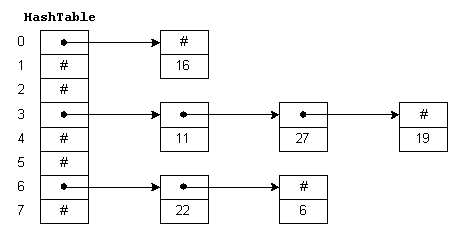
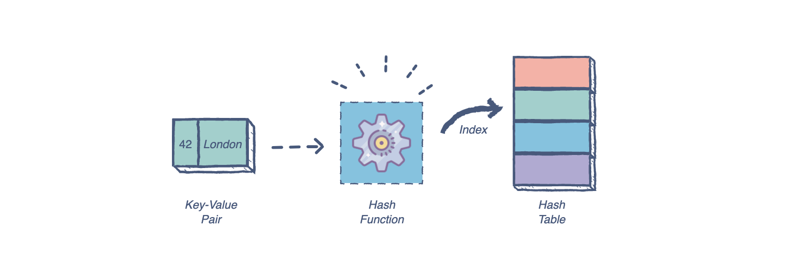

# Hash Tables

---

## What is a HashTable?

*is a data structure which stores data in an associative manner. In a hash table, data is stored in an array format, where each data value has its own unique index value. Access of data becomes very fast if we know the index of the desired data*

---

**Hash tables are made up of two parts:**

- Object: An object with the table where the data is stored. The array holds all the key-value entries in the table. The size of the array should be set according to the amount of data expected.

- Hash function (or mapping function): This function determines the index of our key-value pair. It should be a one-way function and produce the a different hash for each key.

---

**Uses of hash tables**

*Hash tables provide access to elements in constant time, so they are highly recommended for algorithms that prioritize search and data retrieval operations. Hashing is ideal for large amounts of data, as they take a constant amount of time to perform insertion, deletion, and search.*

*In terms of time complexity, the operation is 0(1)0(1). On average, a hash table lookup is more efficient than other table lookup data structures. Some common uses of hash tables are:*

- Database indexing
- Caches
- Unique data representation
- Lookup in an unsorted array
- Lookup in sorted array using binary search

---

**Hash table collisions**

*Sometimes, a hash function can generate the same index for more than one key. This scenario is referred to as a hash collision. Collisions are a problem because every slot in a hash table is supposed to store a single element.*

**Hash collisions are usually handled using four common strategies.**

- Linear probing
- Chaining
- Resizing the Array or List 
- Double hashing

---

# THE END