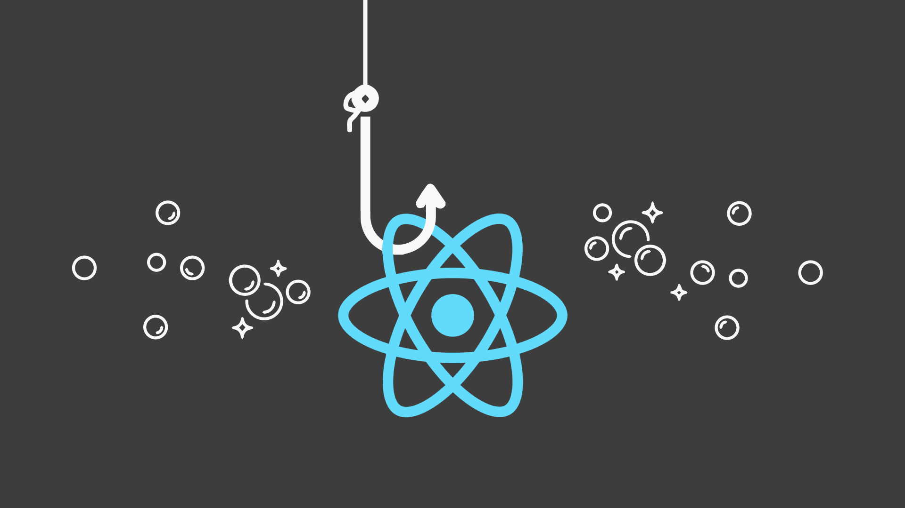

# Hooks API

---

## 1 - Why do we not need more .html pages in a multi-page React app?

*Because we build a react frontend client side that is a Single page Application, it's rendering the component that will render on the page not by render a new page.*

---

## 2 - If we wanted a component to show up on every page, where would we put it and why?

*Inside the` <BrowserRouter />`, outside a `<Route />`*

---

## 3 - What does props.children contain?

*`props.children` contains html tags passed from the parent component to the child component and can access them from the child by `{props.children}`*

---

## Important Terms

Word | Definition 
------------ | -------------
Composition |  is a natural pattern of the component model. It's how we build components from other components, of varying complexity and specialization through props
Children / Child Components |Children components are given props from the parent component, and are rendered partially based on where they are in the parent component.
Hash Routing |Uses the hash in the URL to render the component. Since building a static one-page website, I needed to use this.
Link Routing | Provides declarative, accessible navigation around your application.

---

# React Hooks

**What Are React Hooks, Exactly?**

*functions that let you “hook into” React state and lifecycle features from function components. Hooks don't work inside classes — they let you use React without classes.*

**Why React Hooks?**

*Hooks let us organize the logic inside a component into reusable isolated units: Hooks apply the React philosophy inside a component, rather than just between the components.*

**When would I use a Hook?**

*If you write a function component and realize you need to add some state to it, previously you had to convert it to a class. Now you can use a Hook inside the existing function component.*

---

## Hooks Rules :

- When we write React hooks, we should always call them at the top level, and never nest hook calls in any code.

- Also, they should only be called from within React function components.

- This ensures that they’ll always be called in the same order every time. 

*React relies on the order that the hooks are called to return the right data from hooks*.

---

## What does useEffect do?

*By using this Hook, you tell React that your component needs to do something after render. React will remember the function you passed (we'll refer to it as our “effect”), and call it later after performing the DOM updates*

---

# THE END