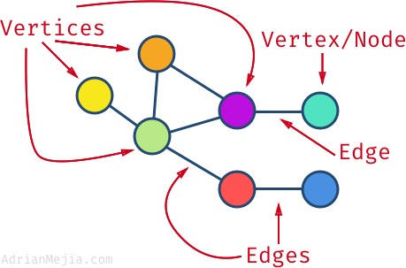
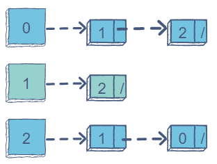
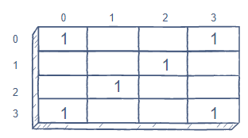

# Graphs

**A graph is a non-linear data structure that can be looked at as a collection of vertices (or nodes) potentially connected by line segments named edges.**

---

*The degree is the number of edges connected to a vertex. E.g., the purple vertex has a degree of 3 while the blue one has a degree of 1.*

*If the edges are bi-directional, then we have an undirected graph. If the edges have a direction, then we have a directed graph or di-graph for short. You can think of it as a one-way street (directed) or two-way street (undirected).*

---

## Acyclic vs Cyclic

- Acyclic: a directed graph that doesn’t have cycles which is when there is a possible path where the node will eventually end up back at itself (like a tree)

- Cyclic: A graph that has cycles

---

## Graphs use:

- used to visually illustrate relationships in the data.
- Electrical Engineering: used in designing of circuit connections
- Google Search
- Google Maps: Various locations are represented as vertices or nodes and the roads are represented as edges
- GPS
- social media

---

## Types of Graph Representations:

**Adjacency List**

*To create an Adjacency list, an array of lists is used. The size of the array is equal to the number of nodes.*

*A single index, array[i] represents the list of nodes adjacent to the ith node.*

**Adjacency Matrix:**

*An Adjacency Matrix is a 2D array of size V x V where V is the number of nodes in a graph. A slot matrix[i][j] = 1 indicates that there is an edge from node i to node j.*

---

# `T` `H` `E` `E` `N` `D`

